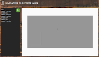
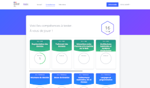

# Accueil { width=128px align=right}

Un peu de NSI, un peu de SI, un peu de PIX : NSIX

Des cours et des outils utilisés au lycée [Younoussa Bamana](https://lpo-bamana.ac-mayotte.fr/)

### :simple-python: Entraînement à la programmation en langage Python

[{ align=left }](https://python.nsix.fr)
Améliorez vos compétences depuis n'importe où :  
des exercices en ligne à faire chez-soi, en classe, sur la barge ou à la plage pour progresser où vous voulez, quand vous voulez : [https://python.nsix.fr]().

### :material-robot: Pilotage de robots à distance

[{ align=right }](https://robots.nsix.fr)

Pilotage à distance des robots utilisés au lycée. Il est possible d'essayer son code directement en ligne. Pour programmer et lancer l'exécution depuis un ordinateur ou un smartphone :

[https://robots.nsix.fr](https://robots.nsix.fr)

### :fontawesome-solid-bolt-lightning: Simulateur de graveur laser

[{align=left}](https://laser.nsix.fr)
Simulateur de graveur laser qui permet de tester du G-Code pour le pilotage d'un graveur laser. Déplacer et découper, à vous d'écrire ou de générer les commandes pour cette découpe.

[https://laser.nsix.fr](https://laser.nsix.fr)

### :material-database: Enquête SQL

[{align=right}](https://enquetesql.nsix.fr)

A vous de mener l'enquête. Vous avez quelques indices, vous êtes malin, alors à vous de trouver qui se cache derrière cette lettre. Une base de données, des requêtes SQL : menez l'enquête.

[https://enquetesql.nsix.fr](https://enquetesql.nsix.fr)

<!--
<a href="https://app.nsix.fr" class="disabled"
  
  
Des questions sur tous les domaines pour vous évaluer

</a>

 -->